# 第二届“贡橙杯”题目考察大纲及解析

## 1.前言

[TOC]

前言占位符

## 2.题目范围及解题方法解析

### Recon 信息搜集

**社会工程学**

* 图片社会工程学

  使用一张全景图片要求提交图片的具体位置。要求选手合理使用地图、方向、阳光、时间等社会工程数据获取信息。

  为了降低难度，此处可以选取百度识图可以直接识别生成结果的图片作为题目

解题方法：

以例题[recon]find_me为例。打开例题，其内容如下：


打开百度识图，

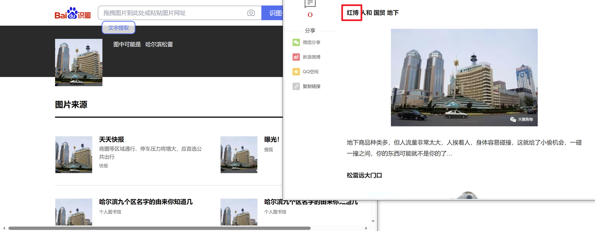

即可得到地址。

某些题目识图可能无法得到结果，可以观察其EXIF信息。

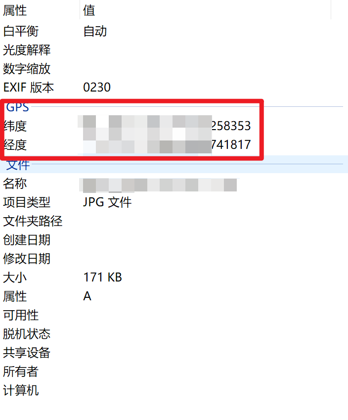

右键打开图片的“属性页”，选择“详细信息”，如果设备记录了拍摄地的GPS，则可以根据GPS获取拍摄地点。

> [地图坐标系转换 - 在线工具 (tool.lu)](https://tool.lu/coordinate)

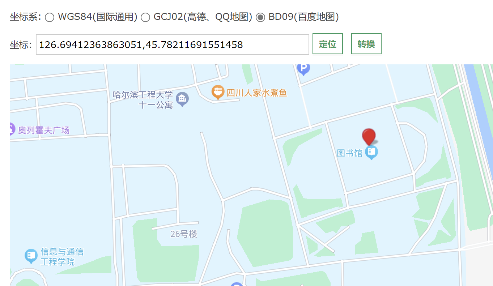

* 网络社会工程学
	采用一切你能想到的方法，抽丝剥茧，针对“安全最薄弱的环节永远是人”这一原则，完成攻击任务。
	


### Forensic 数字取证
**文件取证**

* 文件详细信息
在Windows系统中，文件属性中的“详细信息”一栏常常保存有重要信息
在CTF竞赛时，看看文件的详细信息是一个好习惯

* 文件分解取证
  在CTF竞赛中，我们常常能遇到一些只有一个无意义的文件，其他信息一概没有的情况
  这时候可以考虑文件组合隐写，可以尝试把文件进行分离
  
  

  文件的分离，我们一般使用foremost，关于foremost的教程可以参看[foremost教程](https://www.bilibili.com/read/cv11421773/?spm_id_from=333.999.0.0)
  
  例如题目[image]png_2中
  我们得到图片后，将其进行文件分离
  
  得到分离出来的二维码文件
  
  扫码得到flag
  ```
  flag{ABA8F0FA-9DF8-E38B-EE66-090D6D0B06C8}
  ```
  


**流量取证**
* TCP流量审计
给定一个pcap流量包,要求得到TCP流中隐藏信息。
例如[Forensics]easycap此题
解题方法：
我们需要准备好Wireshark软件，用以打开pcap流量包及对其进行分析
使用Wireshark软件打开easycap.pcap流量包,观察流量追踪信息

观察到全为TCP流,于是使用Wireshark的追踪TCP流功能

得到flag


**图片取证**

* 像素值转化

  给定一系列RGBA数据，要求根据文本数据还原图像。

  解题方法：

  这类题目需要了解图片的像素提取知识。对于PNG、BMP格式的图片，可以方便的使用python提取其像素值信息。

  例如，如果给出下述数据

  ```
  x,y,r,g,b
  67,1,138,200,111
  68,4,151,184,178
  62,3,12,161,122
  180,15,175,174,194
  15,8,100,198,33
  172,7,108,166,81
  24,21,135,122,106
  226,21,182,167,138
  27,21,188,165,109
  193,22,193,182,121
  104,21,125,18,151
  254,25,144,103,127
  27,20,117,122,168
  ```

  根据上述数据，下面使用Python生成一个样例脚本处理上述像素信息，此脚本首先需要安装一些库。对于没有使用过python的同学，可以自行查询如何安装python。可以这么说，python用的好，大学三年过的爽。

  使用指令（Win+R，输入cmd）安装PIL图片处理库

  ```bash
  python -m pip install --upgrade pip
  pip install pillow
  ```

  示例脚本如下（示例脚本不会给全，您需要自行试着完成脚本。python的入门十分简单，你可以在网络上轻易找到相关教程）

  ```python
  from PIL import Image
  
  x=10
  y=10
  img = Image.new('RGB',(x,y),'white')	#指定图片色彩空间，以及背景色
  txt_read = open('data.txt','r')			#读入数据
  #读取数据
  #...
  #处理数据
  #...
  for pixel in data:
      img.putpixel((pixel[0],pixel[1]),(pixel[2],pixel[3],pixel[4])) #执行像素填充，在pixel[0],pixel[1]位置填充RGB色彩。
  img.save('recoveryed.bmp')	#保存图片
  ```

  使用指令运行脚本，注意`data.txt`文件要和脚本放在一个文件夹下

  ```bash
  python script.py
  ```

  之后便可以在文件夹下生成已经恢复的图片。

* GIF转图片

  给定GIF，要求提取GIF的像素，生成二维码。由于GIF是动图，因此需要写脚本生成图片。

  同样的，我们也可以使用PIL库处理GIF文件。PIL库可以使用`ImageSequence`工具将GIF文件解析为逐帧图像。下面以一张交替为黑白色的动图为例，给出示例脚本

  ```python
  import os   
  from PIL import Image, ImageSequence
  
  im = Image.open('sample.gif')				
  iter = ImageSequence.Iterator(im)
  all_frames = ImageSequence.all_frames(im)
  #获取要还原的图片的宽高，这个宽高可能来源于一些信息，或者是计算。
  a=0
  b=0
  #...
  sav = Image.new('RGB',(a,b),'white')		#创建图片
  
  index = 0
  for frame in iter:			#使用迭代器，逐帧处理图片
      pixels = frame.load()	#获取帧的像素
      #处理像素，例如识别、分析像素等
     	#...
      sav.putpixel((int(index/a), index % a), pixels[0,0])
      index = index + 1
  sav.save('result.bmp')
  ```

  由于上述题目都是偏难的题目，有兴趣的同学需要自学Python脚本，并试着在规定时间内给出正确的代码内容。因此题目不设置。

**音频取证**

* 在音频中绘制flag

  即在波形图、频谱图上直接就有flag。

  使用任意的音频解析软件，例如Audacity、Audition打开文件就能在频谱图中看到内容

  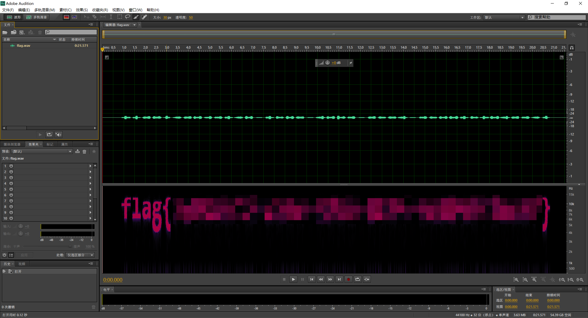

  作为拓展，您也可以在手机上安装Spectorid软件

  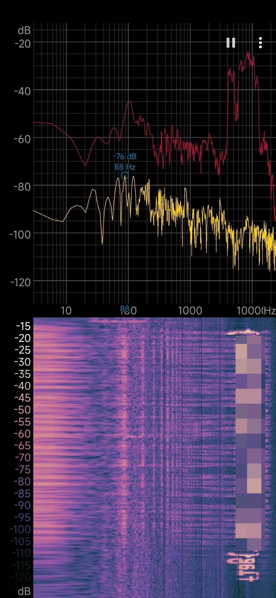

  这样也能看到数据。频谱图藏数据常被用在卫星传送中。

* 莫尔斯码

  > [Morse Code Adaptive Audio Decoder | Morse Code World](https://morsecode.world/international/decoder/audio-decoder-adaptive.html)

  使用上面这个网站，选择Upload

  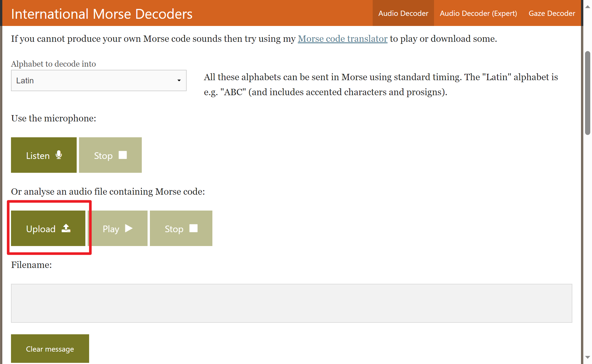

  将需要解析的内容上传到网站上，点击Play即可实时解析摩尔斯码。注意：不能有杂声。

* 单声道音频

  将flag的音频隐藏在正常音频的单声道中。这样的题目直接使用Audition或者任何可以对音频进行编辑的软件删掉某一音轨即可。
  
  > [audition怎么删除轨道添加音轨？AU修改音轨顺序-百度经验 (baidu.com)](https://jingyan.baidu.com/article/ce4366494e5a033773afd318.html)

**视频取证**

* 帧截取技术

  将flag插入在视频的某一帧里，要求截取这一帧。请使用例如Potplayer之类的专业播放器执行帧暂停即可。
  
  [如何精确到帧将视频分割，无损还迅速，你的短视频就由它来裁剪吧 - 知乎 (zhihu.com)](https://zhuanlan.zhihu.com/p/41293015)

**文档取证**

* docx文件的空白、小字符

* pdf文件的不可见内容，水印等

  解题方法：**不要变成星际玩家，留意各种奇怪地标记，例如word里的的黑线**，按下Ctrl+A选取所有内容，复制粘贴最有效，从复制的数据里可以看到全文。

**压缩包取证**

* 暴力破解

  使用弱密码、短数字密码加密zip，使用强密码学加密，要求破解。

  这里主要介绍两款爆破使用的工具

  - `Windows`下的神器 [ARCHPR](http://www.downcc.com/soft/130539.html)

    

    暴力枚举，跑字典，明文攻击，应有尽有。

  - `Linux` 下的命令行工具 [fcrackzip](https://github.com/hyc/fcrackzip)

    ```
    # －b 指定模式为暴破，-c1指定密码类型为纯数字，其它类型可以rtfm,-u这个参数非常重要不然不显示破解出来的密码,-l 5-6可以指定长度
    root@kali:fcrackzip -b -c1 -u test.zip
    ```

* zip伪加密

  修改zip的flag头部

* crc32碰撞、已知明文攻击

  提供局部明文，根据zip给出的crc块校验码爆破。属于难题

  [破解压缩包的几种方式(zip伪加密 爆破 CRC32碰撞 已知明文攻击) - 淚笑 - 博客园 (cnblogs.com)](https://www.cnblogs.com/leixiao-/p/9824557.html)
  
  原理：
  
  `CRC` 本身是「冗余校验码」的意思，`CRC32` 则表示会产生一个 `32 bit` ( `8` 位十六进制数) 的校验值。由于 `CRC32` 产生校验值时源数据块的每一个 `bit` (位) 都参与了计算，所以数据块中即使只有一位发生了变化，也会得到不同的 `CRC32` 值。
  
  `CRC32` 校验码出现在很多文件中比如 `png` 文件，同样 `zip` 中也有 `CRC32` 校验码。值得注意的是 `zip` 中的 `CRC32` 是未加密文件的校验值。
  
  这也就导致了基于 `CRC32` 的攻击手法。
  
  - 文件内内容很少 (一般比赛中大多为 `4` 字节左右)
  - 加密的密码很长
  
  我们不去爆破压缩包的密码，而是直接去爆破源文件的内容 (一般都是可见的字符串)，从而获取想要的信息。
  
  比如我们新建一个 `flag.txt`，其中内容为 `123`，使用密码 `!QAZXSW@#EDCVFR$` 去加密。
  
  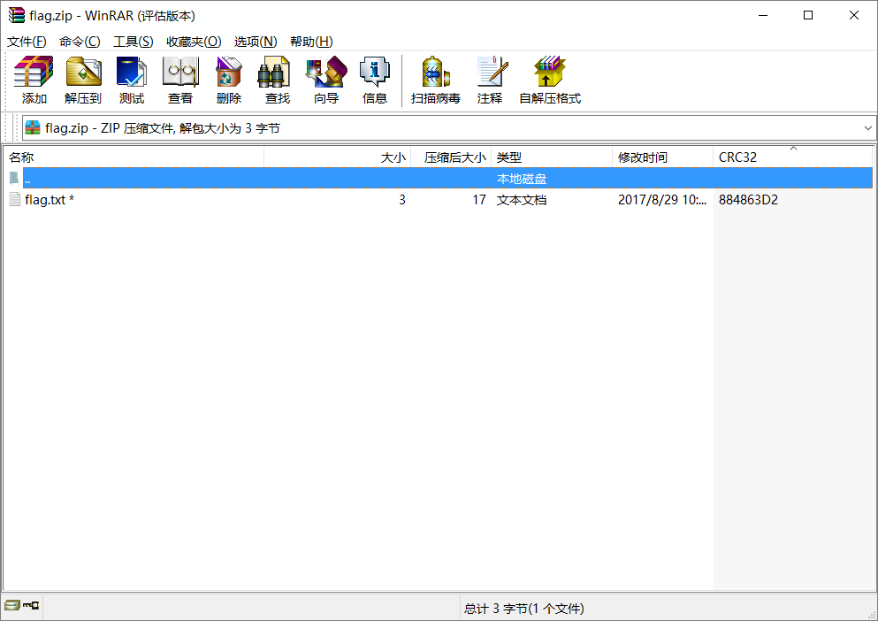
  
  而我们去计算文件的 `CRC32` 值发现和上图中的 `CRC32` 值吻合。
  
  ```
  文件: flag.txt
  大小: 3
  时间: Tue, 29 Aug 2017 10:38:10 +0800
  MD5: 202cb962ac59075b964b07152d234b70
  SHA1: 40bd001563085fc35165329ea1ff5c5ecbdbbeef
  CRC32: 884863D2
  ```
  
  Note
  
   在爆破时我们所枚举的所有可能字符串的 `CRC32` 值是要与压缩源文件数据区中的 `CRC32` 值所对应
  
  ```python
  # -*- coding: utf-8 -*-
  
  import binascii
  import base64
  import string
  import itertools
  import struct
  
  alph = 'abcdefghijklmnopqrstuvwxyzABCDEFGHIJKLMNOPQRSTUVWXYZ0123456789+/='
  
  crcdict = {}			#在此处填入需要爆破的crc
  print "computing all possible CRCs..."
  for x in itertools.product(list(alph), repeat=4):
      st = ''.join(x)
      testcrc = binascii.crc32(st)
      crcdict[struct.pack('<i', testcrc)] = st
  print "Done!"
  
  f = open('flag.zip')
  data = f.read()
  f.close()
  crc = ''.join(data[14:18])
  # 对所有crc表遍历
  #...
  ```
  
  #### 例题 [¶](https://ctf-wiki.org/misc/archive/zip/?h=zip#_5)
  
  > 题目：`Abctf-2016:Zippy`
  
  根据每个压缩包内的文件大小可以推断使用 `CRC32` 攻击手法，获得每个压缩包内的内容后连在一起 `Base64` 解码后是一个加密的压缩包，爆破获得 `flag`。

* ### Stego 隐写术

  **图片隐写**
  
  * LSB隐写
  
    [PNG - CTF Wiki (ctf-wiki.org)](https://ctf-wiki.org/misc/picture/png/#lsb)
  
    LSB 隐写就是修改 RGB 颜色分量的最低二进制位（LSB），每个颜色会有 8 bit，LSB 隐写就是修改了像数中的最低的 1 bit，而人类的眼睛不会注意到这前后的变化，每个像素可以携带 3 比特的信息。
  
    下面是LSB隐写的一个例子：
  
    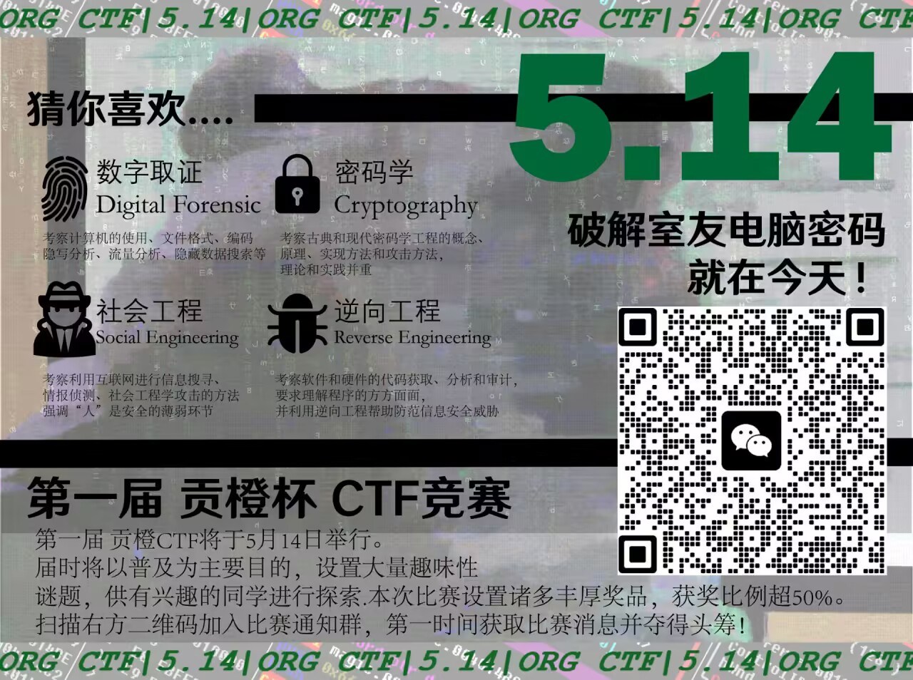
  
    这个图片包含LSB隐写信息，使用StegSolver 打开，选择Analyse -> Data Extract，选择Bit Planes可以看到隐写的信息内容：
  
    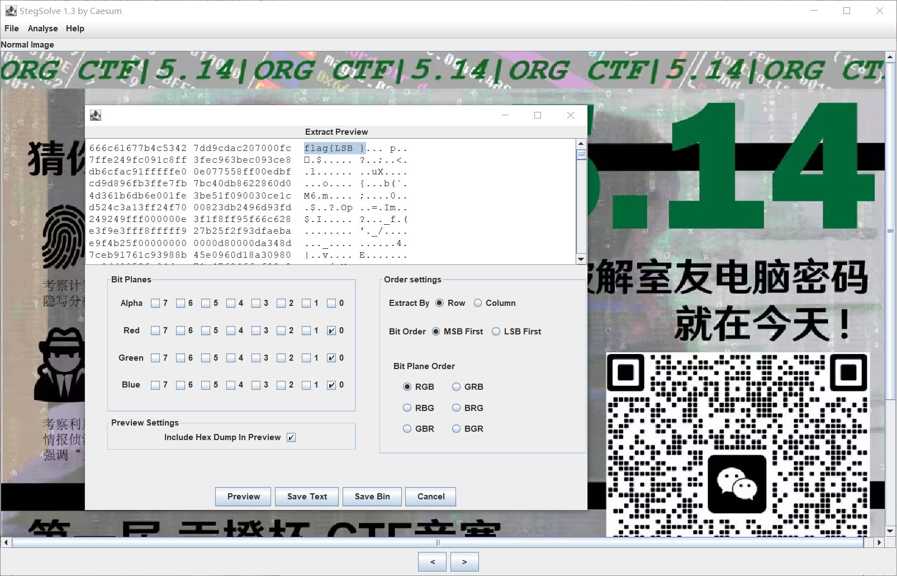
  
  * PNG修复
  
    * SIZE（IHDR修复）[PNG - CTF Wiki (ctf-wiki.org)](https://ctf-wiki.org/misc/picture/png/#ihdr)
  
    文件头数据块 IHDR（Header Chunk）：它包含有 PNG 文件中存储的图像数据的基本信息，由 13 字节组成，并要作为第一个数据块出现在 PNG 数据流中，而且一个 PNG 数据流中只能有一个文件头数据块
  
    其中我们关注的是前 8 字节的内容
  
    | 域的名称 | 字节数  | 说明                   |
    | :------- | :------ | :--------------------- |
    | Width    | 4 bytes | 图像宽度，以像素为单位 |
    | Height   | 4 bytes | 图像高度，以像素为单位 |
  
    我们经常会去更改一张图片的高度或者宽度使得一张图片显示不完整从而达到隐藏信息的目的。
  
    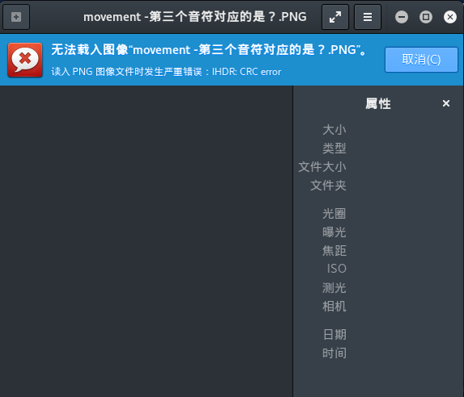
  
    这里可以发现在 Kali 中是打不开这张图片的，提示 `IHDR CRC error`，而 Windows 10 自带的图片查看器能够打开，就提醒了我们 IHDR 块被人为的篡改过了，从而尝试修改图片的高度或者宽度发现隐藏的字符串。
  
    ##### WDCTF-FINALS-2017[¶](https://ctf-wiki.org/misc/picture/png/#wdctf-finals-2017)
  
    观察文件可以发现, 文件头及宽度异常
  
    ```
    00000000  80 59 4e 47 0d 0a 1a 0a  00 00 00 0d 49 48 44 52  |.YNG........IHDR|
    00000010  00 00 00 00 00 00 02 f8  08 06 00 00 00 93 2f 8a  |............../.|
    00000020  6b 00 00 00 04 67 41 4d  41 00 00 9c 40 20 0d e4  |k....gAMA...@ ..|
    00000030  cb 00 00 00 20 63 48 52  4d 00 00 87 0f 00 00 8c  |.... cHRM.......|
    00000040  0f 00 00 fd 52 00 00 81  40 00 00 7d 79 00 00 e9  |....R...@..}y...|
    ...
    ```
  
    这里需要注意的是，文件宽度不能任意修改，需要根据 IHDR 块的 CRC 值爆破得到宽度, 否则图片显示错误不能得到 flag。
  
    ```python
    import os
    import binascii
    import struct
    
    misc = open("misc4.png","rb").read()
    _crc = 0		#填入CRC
    for i in range(1024):
        data = misc[12:16] + struct.pack('>i',i)+ misc[20:29]
        #处理CRC32
        if crc32 == _crc:
            print i
    ```
  
    得到宽度值为 709 后，恢复图片得到 flag。
  
    * CRC修复
  
  * 图片截断和合并
  
    在IEND块后另附图片[PNG - CTF Wiki (ctf-wiki.org)](https://ctf-wiki.org/misc/picture/png/)

### Encode 编码转换

编码是将信息转换为可用于传输、存储或处理的特定格式的过程。在计算机中，数据以二进制形式存在，但是在实际应用中，我们需要将数据转换成文本、音频、视频等可读性更强的形式。

常见的编码包括ASCII、Unicode、UTF-8、Base64等。编码可以将文本、图像、音频、视频等数据转换为特定的格式，以方便在计算机系统中进行传输、存储和处理。编码的重要性在于它使得不同的系统之间可以互相交换数据，并确保数据的正确性和完整性。在CTF竞赛中，编码是非常重要的一环，因为在解题的过程中，我们需要不断地将各种编码转换成其他编码格式，以便获得关键信息。

在CTF竞赛中，经常需要对各种编码进行解码或编码，例如Base64、ASCII、Unicode等等。编码转换模块是一种常见的工具，可以将不同编码的数据转换成其他编码格式。在CTF竞赛中，编码转换模块是一个非常重要的工具，尤其是在解题的过程中。以下是一些常用的编码格式以及对应的编码转换方法。

关于编码、解码工具，我们推荐[ToolsFx 编码解码工具箱](https://github.com/Leon406/ToolsFx),也可以使用下面提到的工具

**进制转换**

常见的进制转换包括十进制转二进制、二进制转十进制、十进制转八进制、八进制转十进制、十进制转十六进制、十六进制转十进制等等。在CTF竞赛中，进制转换是非常常见的一种操作，因为很多题目会将数字以不同的进制方式进行编码，需要我们进行相应的进制转换才能得到正确的答案。

* 给定各种不同的进制信息，考察转换为其他进制
* 甚至可以考一考IEEE的浮点数，作为难题

**Base**

- Base32

​	base32字母表：A-Z2-7

​	以例题[base]base32为例。打开例题，其内容如下：

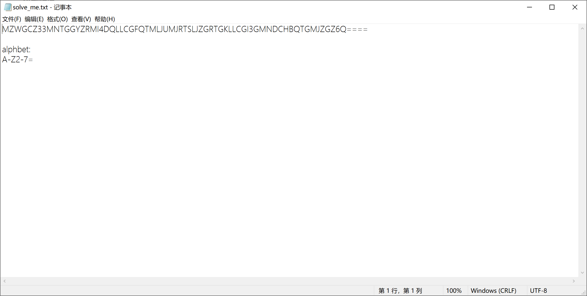

根据题目描述，确认编码格式为base32编码

试用在线编码工具，得到最终flag：

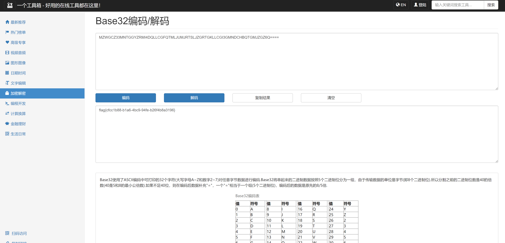

* Base64

  以例题[base]base64为例。打开例题，其内容如下：

  ZmxhZ3s0MTY2NmQxMC00ZWVkLTRhOGUtYTRkMC0zN2YxZDQ0NmRlZDh9

  根据题目描述，确认编码格式为base64编码

  即可通过解码工具得到最终flag

* Base58和Base100

  - Base58字母表：123456789ABCDEFGHJKLMNPQRSTUVWXYZabcdefghijkmnopqrstuvwxyz

    以例题[base]base58为例。打开例题，其内容如下：

    2i9Q8AtFEuZ6XBmzSUdzxqZaQ1TACPAae5wMfTBJkQawcm6Gyx4jTxCRSC

    根据题目描述，确认编码格式为base58编码

    使用在线编码工具，即可得到最终flag

  - Base100字母表：emjoy

    以例题[base]base100为例。打开例题，其内容如下：

    👝👣👘👞👲🐮👜🐬🐫👛👜👚🐧🐤👛👙🐨🐯🐤🐫👜🐧🐧🐤🐯🐨🐨🐨🐤👚🐰👙🐯🐭🐰🐪👘👝👝🐮🐬👴

    根据题目描述，确认编码格式为base100编码

    使用在线编码工具，即可得到最终flag

    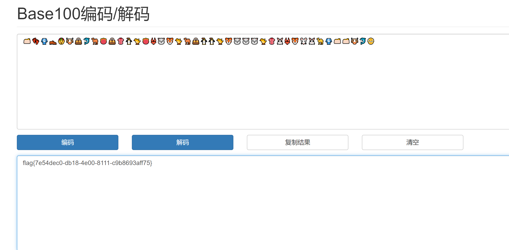

  [Base100编码/解码 - 一个工具箱 - 好用的在线工具都在这里！ (atoolbox.net)](http://www.atoolbox.net/Tool.php?Id=936)

**url**

URL编码（也称百分号编码）是一种将URL中的非ASCII字符和特殊字符转换成可打印字符的编码方式。URL编码是因为URL中只能包含ASCII字符，如果URL中包含非ASCII字符或特殊字符，就需要进行编码以便在互联网上传输和处理。

URL编码使用%xx的形式来表示一个字符，其中xx为该字符在ASCII码表中对应的十六进制值。例如，字母“A”在ASCII码表中的十六进制值为41，那么在URL编码中就用“%41”来表示。另外，一些特殊字符也需要进行编码，例如空格用“%20”表示，加号用“%2B”表示，等号用“%3D”表示等。

**QR**

* QR二维码，可以作为简单考点考察

* 可以考察下述图码中的一个或者几个

  * PDF417条码，用于证件/机票识别
  * 汉信码
  * Data Matrix
  * Aztec Code 
  
  这些码都可以在[在线二维码生成,二维码制作 - 兔子二维码 (tuzim.net)](https://tuzim.net/)   [Barcode Reader](https://online-barcode-reader.inliteresearch.com/)生成和解码

**简单密码学**

* 摩斯密码

  摩斯密码是一种使用点和线组合表示字母和数字的编码方式。摩斯密码可以用于传输电报和短波无线电通信，它的编码方式简单、易于传输，并且可以在嘈杂的环境中使用。

  在CTF竞赛中，摩斯密码常常用于隐藏在图片、音频或文本文件中的一段重要信息。对于莫斯密码，我们可以使用Python或其他编程语言的正则表达式或者字符串处理函数来解码，具体的解码方法取决于摩斯密码的编码方式和形式。

  以例题[encode]morse为例。打开例题，其内容如下：

  ```
  ..-. ..-. ..--- ---.. .- ..... --... ----- -....- -.... ---.. --... .- -....- ....- ---.. ..-. -.. -....- ----. .---- -... -.-. -....- ..-. ...-- ..-. ---.. -.-. ---.. ..... ..-. .---- ...-- ..-. ----.
  ```

  通过解码器工具，即可求出相关flag

* 凯撒密码

  凯撒密码（Caesar Cipher）是一种最简单的替换密码，是古罗马时期凯撒大帝使用的加密方法，其原理是通过将明文中的每个字母都按照一个固定数目进行偏移，从而得到密文。例如，当偏移数为3时，字母A将被替换成字母D，字母B将被替换成字母E，以此类推。

  凯撒密码的加密过程非常简单，只需要按照以下步骤进行：

  1. 选择一个偏移量n，通常为1-25之间的整数。
  2. 将明文中的每个字母都向后偏移n个位置。如果超过了字母表的末尾，则从字母表的开头重新开始计数。
  3. 得到的密文就是偏移后的字母序列。

  以例题[encode]ceaser为例。打开例题，其内容如下：

  ```
  iodj{27g51g78-f846-44e5-d542-9d60f6g88id1}
  ```

  经过循环移位，即可得到最终flag。

- ROT7

  ROT7是一种简单的凯撒密码变形，与传统的凯撒密码不同的是，ROT7将每个字母向前偏移7个位置，而不是向前偏移一个固定的偏移量。因此，ROT7的加解密方式与凯撒密码类似，只是偏移量为7。

  以例题[encode]rot7为例。打开例题，其内容如下：

  ```
  mshn{71l8289m-m12k-12hh-5l60-87jki51l4402}
  ```

  通过在线编码，求解flag

  经过循环移位，即可得到最终flag。

* ROT13

  ROT13是一种简单的凯撒密码变形，它将每个字母向前偏移13个位置，即使用偏移量n=13进行加密和解密。因此，ROT13的加密和解密方式非常简单，只需要将明文中的每个字母都向前偏移13个位置，得到密文，或将密文中的每个字母都向前偏移13个位置，得到原始的明文。

  以例题[encode]rot13为例。打开例题，其内容如下：

  ```
  synt{37r4845s-s78q-78nn-1r26-43pqo17r0068}
  ```

  通过在线编码，求解flag

  经过循环移位，即可得到最终flag。

* brainfuck

  Brainfuck是一种极简主义的程序设计语言，它由Urban Müller于1993年发明。Brainfuck语言的设计思想是将计算机的基本操作进行极度简化，仅仅使用8个命令来控制数据的存取和处理，因此它的语法非常简单，但同时也非常难以阅读和编写。

  | 指令 | 意义                                                         |
  | ---- | ------------------------------------------------------------ |
  | >    | 将数据指针向右移动一位                                       |
  | <    | 将数据指针向左移动一位                                       |
  | +    | 将当前数据指针所指向的内存单元的值加1                        |
  | -    | 将当前数据指针所指向的内存单元的值减1                        |
  | .    | 输出当前数据指针所指向的内存单元的值                         |
  | ,    | 从输入设备读取一个字符，并将其存入当前数据指针所指向的内存单元中 |
  | [    | 如果当前数据指针所指向的内存单元的值为0，则跳转到与之匹配的]指令之后 |
  | ]    | 如果当前数据指针所指向的内存单元的值不为0，则跳转到与之匹配的[指令之前 |

  以例题[encode]brainfuck为例。打开例题，其内容如下：

  ```
  +++++ +++++ [->++ +++++ +++<] >++.+ +++++ .<+++ [->-- -<]>- -.+++ +++.< ++++[ ->+++ +<]>+ +++.< +++++ +++[- >---- ----< ]>--. <++++ ++[-> +++++ +<]>+ ++++. <++++ ++[-> ----- -<]>- ----- ---.+ +.+.< +++++ +[->+ +++++ <]>++ +++++ ++.<+ +++++ [->-- ----< ]>--- ----- ----. <++++ ++[-> +++++ +<]>+ +++++ ++++. <++++ +++[- >---- ---<] >---- -.+++ +++++ +.++. <++++ ++[-> +++++ +<]>+ +++++ ++++. .<+++ ++++[ ->--- ----< ]>--- ----- .++++ +++.< +++++ +[->+ +++++ <]>++ +++++ +++.+ ++.<+ +++++ +[->- ----- -<]>- --.-- --.<+ ++[-> +++<] >+++. ----- --.<+ +++++ +[->+ +++++ +<]>+ ++..< +++++ ++[-> ----- --<]> ----- ---.< +++[- >+++< ]>+.- ---.< +++++ ++[-> +++++ ++<]> ++.-. <++++ +++[- >---- ---<] >--.+ ++++. --.-- ---.< +++++ ++[-> +++++ ++<]> ++++. .<+++ ++++[ ->--- ----< ]>--. ++.<+ +++++ ++[-> +++++ +++<] >++++ +++++ .<
  ```

  考虑brainfunk语言，经过解码，即可得到最终flag

* Ook!

  Ook!是一种基于Morse密码的编程语言，它的语法非常简单，只有三个命令：Ook.、Ook?和Ook!。这些命令分别对应Morse密码中的点、点点点、和横线。

  Ook!语言的程序由一系列的Ook!命令组成，每个命令以Ook.、Ook?或Ook!开始，以一个空格或三个空格作为分隔符，表示不同的Morse密码信号之间的间隔。

  Ook!的语法简单，但由于其使用了Morse密码的编码方式，Ook!的可读性较差，很难被人类直接阅读和理解。在CTF竞赛中，Ook!常常用作一种隐藏在其他数据中的加密信息，需要掌握其基本语法和解码方法。

**其他整活编码**

* 佛曰

  [新约佛论禅/佛曰加密 - PcMoe!](http://hi.pcmoe.net/Buddha.html)

* 社会主义核心价值观编码

  [核心价值观编码 - Bugku CTF](https://ctf.bugku.com/tool/cvecode)

* https://ctf.bugku.com/tool/cvecode)

### CRYPTO 密码学

* RSA加密  低加密指数攻击

  加密指数e非常小，一般拿到的是多组n和c，且只有一个e，e还很小。且模数n不同，但使用相同的加密指数e进行多次加密。
  
  感兴趣的同学可以自行搜索“低加密指数攻击”。由于这是复杂的密码学方向，留给有兴趣的读者自行学习。
  
### Web 网络攻防

* Web简介
在 CTF 竞赛中，WEB 也是占比重很大的一个方向之一，WEB 类的题目种类繁多，知识点细碎，时效性强，能紧跟时下热点漏洞，贴近实战。

WEB 类的题目包括但不限于：SQL 注入、XSS 跨站脚本、CSRF 跨站请求伪造、文件上传、文件包含、框架安全、PHP 常见漏洞、代码审计等。

* 网络请求基础
在客户机和服务器之间进行请求-响应时，两种最常被用到的方法是：GET 和 POST。

GET - 从指定的资源请求数据。
```
	eg. https://example.com?name1=value1&name2=value2
	此请求方式即为GET方法，可以看到其的请求参数在URL被明文显示。

	解析:可以看到,当我们需要对 http://example.com 进行GET请求时,首先应该明确请求URL为 http://example.com ,随后,用?标识		需要传入的变量name1,name2即为变量名;value1,value2即为传入的实际值。
```

POST - 向指定的资源提交要被处理的数据。
GET 提交参数一般显示在 URL 上，POST 通过表单提交不会显示在 URL 上，POST 更具隐蔽性。
```
	eg. 我们要对 https://127.0.0.1 进行POST请求
	由于浏览器内一般无法通过用户界面进行POST请求的发送
	下面我们使用Postman进行演示
```

```
	如图，我们对 http://127.0.0.1/api/user/login 发起一次POST请求
	请求体在下方显示
	username=123
	password=123
	此时可以看到服务器给我们返回了登录状态(没错这是一次登录的请求)
```

登录成功！
关于GET和POST的原理，如下图所示:


* 开发者工具的使用
  此处因已有大量文档，所以不再赘述，请参看文档

  [什么是浏览器开发者工具？](https://developer.mozilla.org/zh-CN/docs/Learn/Common_questions/Tools_and_setup/What_are_browser_developer_tools)
  
  我们下面讲讲开发者工具在CTF的基础应用：
  
  1.前端界面查看
  
  
  
  2.网络请求查看
  
  
  当然，开发者工具的用法远远不止这两个，更多的用法还需同学们自己发掘。

### REVERSE 逆向工程
```
Reverse engineering, also called back engineering, is the process by which a man-made object is deconstructed to reveal its designs, architecture, or to extract knowledge from the object; ------ from wikipedia
```
软件代码逆向主要指对软件的结构，流程，算法，代码等进行逆向拆解和分析。

本赛事的逆向工程*不*

>  涉及 Windows、Linux、Android 平台的多种编程技术，要求利用常用工具对源代码及二进制文件进行逆向分析，掌握 Android 移动应用 APK 文件的逆向分析，掌握加解密、内核编程、算法、反调试和代码混淆技术。 ------ 《全国大学生信息安全竞赛参赛指南》

一切尽在不言中

[CE修改器使用教程入门篇\] - lyshark - 博客园 (cnblogs.com)](https://www.cnblogs.com/LyShark/p/10799926.html)

* 工具及环境列表
```
做re你需要
debugger
-ghidra
-IDA pro
-ollydbg
-x64dbg
-cheatengine
-gdb
unpacker
-越多越好！
monitor
-promon
-APImonitor
需要有虚拟机环境，包括linux（amd64/armv8）windows x64
针对语言：
dnspy -MSIL反编译
de4dot -MSIL反混淆
oldrod -MSIL反虚拟机
（C# F# VB.NET）
uncompyle6 python反编译
ast-tools js反混淆
其他需要掌握的脚本语言：lua powershell js shell
```
* 常用壳
```
常见的壳：
upx 压缩壳
themida 
enigma
vmprotect（遇到建议直接放弃，.net除外）
```
* 常用加密方法
```
关于python常见的代码加密方法：Cython与修改opcode的自编译版本
常见的exe程序加密方法：花指令，控制流混淆，变量名混淆（解释型语言），虚拟机，Hook，驱动通信
```

### PWN 二进制漏洞利用

Pwn 题目主要考察二进制漏洞的发掘和利用，需要对计算机操作系统底层有一定的了解。在 CTF 竞赛中，PWN 题目主要出现在 Linux 平台上

本教程不对PWN作详细叙述，感兴趣的同学可以咨询学长学姐以及自行查阅相关资料。

## 3. 参考资料

本赛事所有题目都可以在

[简介 - CTF Wiki (ctf-wiki.org)](https://ctf-wiki.org/)

找到题解和详细的技术说明。

## 4. 尾声
<strong>本教程第一版编者按</strong>

感谢您看到这里，本教程形成十分仓促，恕不能全面涵盖整个CTF的竞赛内容。信息安全包罗万象，妙趣横生，在此，出题人希望使用一首诗结束解析。

> 昔年曾见此湖图，不信人间有此湖。
>
> 今日打从湖上过，画工还欠费工夫。

也许读者在未来的某一天，在取得真正的CTF竞赛和信息安全的荣誉之后能再次想起学校同学草草准备的这份文档，到时候希望读者也能拍打着这篇算不上基础的教程，说到“编者还欠费工夫”

<strong>本教程第二版编者按</strong>

感谢同学们对本次比赛的支持，本教程虽然历经两次修订，但由于编者水平及种种原因，恕不能全面覆盖整个CTF竞赛内容，CTF竞赛，或者说网络安全本就博大精深，知识点星罗棋布，但是——
> 剑阁峥嵘而崔嵬，一夫当关，万夫莫开。

编者们希望能经由这个教程，这次比赛，为大家揭开CTF竞赛对同学们而言神秘的面纱，为其祛魅，让更多的同学们成为新时代的“剑阁”，为国家，社会的网络安全贡献出自己的力量。
“也许读者在未来的某一天，在取得真正的CTF竞赛和信息安全的荣誉之后能再次想起学校同学草草准备的这份文档，到时候希望读者也能拍打着这篇算不上基础的教程，说到‘编者还欠费工夫’”

> 编者和特别致谢
>
> ------
> *第二版编者及“第二届贡橙杯”组织团队成员*：
>
> **jht3**：提供必要的帮助、部分赛题、题解和练习赛赛题及题解
>
> **debidong**：提供必要的帮助、部分赛题、题解和练习赛赛题及题解
>
> **hed10ne**：提供必要的帮助、部分赛题、题解和练习赛赛题及题解
>
> **penguin**：编写赛题、赛题题解，本教程第二版的编纂
>
> **MadLongTom**：编写赛题、赛题题解，本教程第二版的编纂
>
> **Sky9464**：赛事组织及策划
>
> **甲乙丙丁**：赛事组织及策划
>
> **玄世昌老师**：提供赛事指导、赛事组织、赛事校方支持
>
>
> *第一版编者及“第一届贡橙杯”组织团队成员*：
> **hed10ne**：提供题目审核、赛题题解审核和练习赛题目审核、本教程第一版的编纂
>
> **jht3**：提供题目审核、赛题题解审核和练习赛题目审核、本教程第一版的编纂
>
> **BOBQWERA**：提供赛事指导、赛事组织和策划、本教程第一版的编纂
>
> **玄世昌老师**：提供赛事指导、赛事组织、赛事校方支持
>
>
> 特别致谢：
>
> 哈尔滨工程大学 计算机科学与技术学院
>
> 哈尔滨工程大学 计算机科学与技术学院科协
>
> 哈尔滨工程大学 计算机科学与技术学院各友社组织
>
> 以及在本教程、赛题编制过程中给出过帮助的诸多成员，他们的名字人人知晓，他们的功绩不会被忘记。

完结撒花！

